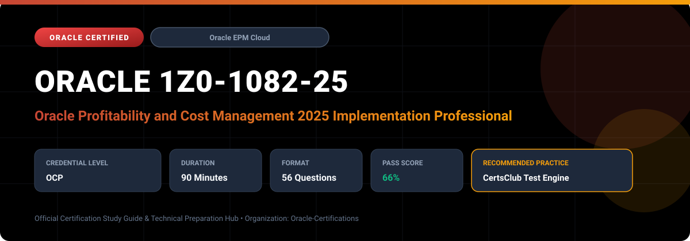

  

# Oracle 1Z0-1082-25: Oracle Profitability and Cost Management 2025 Implementation Professional

---

## 1. Exam Overview & Candidate Profile

The **Oracle 1Z0-1082-25: Oracle Profitability and Cost Management 2025 Implementation Professional** examination is engineered for enterprise architects, solution specialists, functional consultants, and implementation professionals seeking formal industry recognition of their proficiency in Oracle technologies.

The Oracle Profitability and Cost Management 2025 Implementation Professional (1Z0-1082-25) certification demonstrates candidate capability in implementing Enterprise Profitability and Cost Management (EPCM) Cloud. Candidates validate their ability to build multi-tier allocation models, define rule sets, configure drivers, analyze cost traceability, and deliver actionable profitability intelligence across products, customers, and business channels.

### Target Audience & Prerequisites
- **Target Roles**: Implementation Specialists, Cloud Architects, Technical Leads, Enterprise Functional Consultants, and Systems Engineers.
- **Recommended Experience**: 1–2 years of practical, hands-on experience designing, implementing, and maintaining corresponding Oracle Cloud solutions.
- **Credential Earned**: Oracle Certified Professional (OCP).

---

## 2. Key Exam Specifications

| Specification | Details |
| :--- | :--- |
| **Exam Code** | **Oracle 1Z0-1082-25** |
| **Official Title** | Oracle Profitability and Cost Management 2025 Implementation Professional |
| **Certification Track** | Oracle Enterprise Performance Management Cloud |
| **Exam Duration** | 90 Minutes |
| **Number of Questions** | 56 Questions |
| **Passing Score** | 66% |
| **Question Format** | Multiple Choice (Single/Multiple Answer), Scenario-Based Questions |
| **Delivery Provider** | Oracle University / Pearson VUE (Online Proctored or Test Center) |
| **Recommended Practice Engine** | [CertsClub Oracle Practice Tests](https://www.certsclub.com/oracle/1z0-1082-25-dumps.html) |

---

## 3. Official Blueprint & Exam Domain Breakdown

The examination assesses candidate competencies across core functional domains weighted as follows:

| Domain Area | Weighting |
| :--- | :--- |
| **Profitability Architecture & Model Design** | `25%` |
| **Rule Sets, Allocation Rules & Custom Calculations** | `30%` |
| **Data Integration, Staging & Driver Ingestion** | `15%` |
| **Calculation Analysis, Rule Balancing & Traceability** | `15%` |
| **Dashboards, Reports, Financial Analysis & Security** | `15%` |

---

## 4. Deep Dive into Complex & Challenging Technical Topics

To secure a passing score on the 1Z0-1082-25 exam, candidates must master the following advanced concepts:

- Designing dimensional models with Cost Centers, Activities, Products, Customers, and Channels.
- **Structuring multi-stage allocation rule sets**: indirect cost pooling, activity cost assignment, and customer/product cost delivery.
- Configuring driver formulas, allocation formulas, and reciprocal or iterative allocation processes.
- Using Rule Balancing and Trace Allocation tools to audit costs from origin to final destination across allocation hops.

---

## 5. Scenario-Based Demo & Practice Questions

### Question 1
In Oracle Enterprise Profitability and Cost Management (EPCM) Cloud, what tool allows financial analysts to trace the exact multi-step path and calculation rules that allocated an indirect overhead cost to a specific customer account?

A) Trace Allocation
B) Calculation Manager
C) Account Inspector
D) Data Management Sync

- **Correct Answer**: `A) Trace Allocation`  
- **Technical Explanation**: Trace Allocation provides an interactive visual and tabular audit trail that displays the step-by-step lineage of allocated costs backwards to their original source expenses or forwards to target dimensions.

---

### Question 2
Which rule type in EPCM is used when costs need to be distributed from a shared IT service department across multiple operating divisions based on employee headcount ratios?

A) Standard Allocation Rule
B) Currency Translation Rule
C) Elimination Rule
D) Movement Request Rule

- **Correct Answer**: `A) Standard Allocation Rule`  
- **Technical Explanation**: Standard Allocation Rules take a source pool of funds (IT expenses), apply a driver metric (headcount ratio), and distribute the funds to target destination dimension intersections.

---

## 6. Recommended Preparation Strategy & Practice Testing Engine

Achieving certification in **Oracle 1Z0-1082-25** requires balanced theoretical study and scenario-based simulation practice:

1. **Review Oracle Documentation**: Master architecture guides, implementation workbooks, and administration manuals on the Oracle Help Center.
2. **Hands-on Lab Practice**: Execute real-world configuration, policy setup, and troubleshooting tasks in your cloud tenancy or test instance.
3. **Simulated Exam Drills**: Practice answering timed, scenario-based multiple-choice questions to familiarize yourself with the question formats, traps, and timing constraints.

### Practice With CertsClub
For realistic practice questions, updated dumps, and mock testing environments:
- **Resource**: [CertsClub Oracle Practice Test Engine](https://www.certsclub.com/oracle/1z0-1082-25-dumps.html)
- **Special Discount**: Use coupon code **`club20`** during checkout for an instant **20% discount** on all practice exam bundles and testing engines.

---

## 7. Official Documentation & References

- [Oracle University Certification Registry](https://education.oracle.com/)
- [Oracle Help Center Documentation Portal](https://docs.oracle.com/)
- [Oracle Cloud Infrastructure & Applications Guides](https://docs.oracle.com/en/cloud/)
- [CertsClub Oracle Certification Exam Practice](https://www.certsclub.com/oracle/1z0-1082-25-dumps.html)

---

## 8. SEO & Discovery Keywords

`oracle 1z0-1082-25, oracle 1z0-1082-25 exam, oracle 1z0-1082-25 dumps, 1Z0-1082-25 practice questions, 1Z0-1082-25 study guide, oracle 1z0-1082-25 syllabus, oracle profitability and cost management 2025 implementation professional, certsclub 1z0-1082-25`
